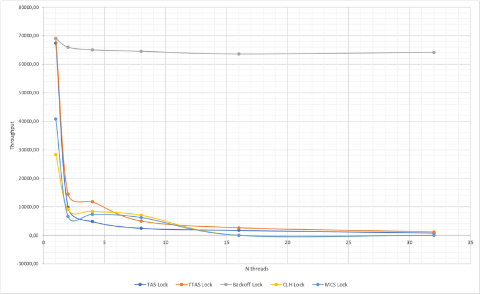
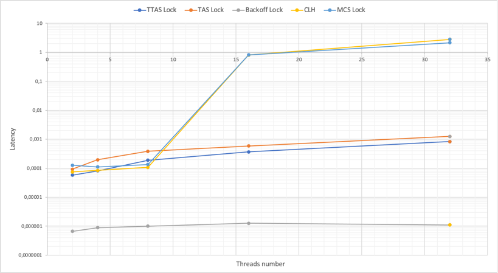
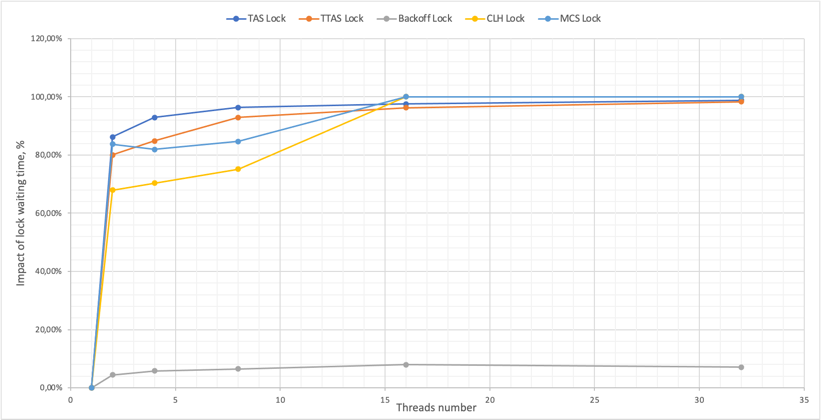

# Отчет по локам
В данном эксперименте исследовалась производительность локов (TAS, TTAS, Backoff, MCS, CLH),
в зависимости от количества потоков (от 1 до 32, логарифмическая шкала).

## Содержание
1. Описание эксперимента
   - Параметры бенчмарка
   - Необходимость и параметры прогрева
   - Методология оценки производительности
2. Результаты
3. Выводы

## 1.Описание эксперимента
### Параметры установки
Бенчмарк запускался со временем выполнения `60000 мс` с вариацией типа лока (TAS, TTAS, Backoff, MCS, CLH)
и числа потоков (1, 2, 4, 8, 16, 32).
```shell
benchmark --timeoutMs 60000 --type [TAS/TTAS/Backoff/MCS/CLH] --threadsCount [1/2/3/8/16/32]
```

### Необходимость прогрева и параметры
При старте нового JVM процесса (запуск приложения) все требуемые классы загружаются в память (jvm) сущностью `ClassLoader`'а.
Этот процесс происходит в 3 этапа:
- `BootstrapClassLoader` загружает Java код и требуемые Java classes из пакета java.lang.Object в память.
- `ExtensionClassLoader` отвечает за загрузку всех файлов JAR, расположенных по пути java.ext.dirs.
В приложениях, где не используется Maven или Gradle, разработчик добавляет JAR вручную, все эти классы загружаются на этом этапе.
- `ApplicationClassLoader` загружает все классы, расположенные по пути к классу приложения.

Весь этот процесс инициализации основан на схеме ленивой загрузки. То есть, загружаем класс только в случае отсутвия этого класса в памяти.

После завершения загрузки классов все классы, используемые во время запуска процесса, попадают в кэш
JVM, что ускоряет их доступ во время выполнения. Другие классы загружаются по запросу.
Например, при первом запуске нашего приложения счётчик значительно меньше, чем его среднее значение
по запускам. Этот период "разминки" можно отнести к ленивой загрузке класса и just-in-time компиляции.

При тестировании производительности нам нужно обеспечить минимальную latency, поэтому необходимо
заранее кэшировать все классы, чтобы они были доступны мгновенно при доступе во время выполнения.
Что говорит нам о необходимости прогрева. Результаты ниже подтверждают наши предположения:


Заметим, что результаты производительности выше (на ~5%) с прогревом, чем результаты без прогрева и с увеличением
времени эта разница уменьшается. Это можно объяснить тем, что оптимизация кода (JIT-компилятор) у нас происходит
с некоторого момента на определённом значении счётчика, которое одинаковое (колеблется в небольших
пределах) от запуска к запуску, и с увеличением времени эксперимента у нас идёт рост значения
счётчика, соответственно вклад значения счётчика, полученного непосредственно перед оптимизацией,
уменьшается.

Необходимость в прогреве есть, т.к. это позволит нам улучшить производительность на ~5%, а при тестировании
производительности нам важны и такие улучшения. Небольшое улучшение в производительности можно объяснить тем, что
в критической секции выполняется достаточно небольшая работа на каждой итерации, что приводит к не таким
заметным улучшениям после оптимизации.

Также отметим, что здесь приведены результаты MCS лока, т.к. на этом типе лока наблюдалась
наибольшая разница в производительности (с прогревом и без него). Все результаты можно посмотреть
в файлике [calculations/results.xlsx](calculations/Results.xlsx).

### Методология оценки производительности

Для каждого типа лока `(TAS/TTAS/Backoff/MCS/CLH)` и количества потоков `(1/2/3/8/16/32)` запускаем
наш бенчмарк с `timeout=60s` -- всего 30 типов тестов, в каждом из которых по 6 итераций запуска
(перед которыми следовало несколько итераций прогрева).

Далее берём результаты этих шести итераций и вычисляем `throughput` и `latency` по следующим формулам:

где `AVG(Counter)`- среднее арифметическое значение счётчика за `n` итераций, а `AVG(time)` - среднее
арифметическое время выполнения (в миллисекундах) одной итерации за `n` итераций.

Заметим, что вычисленное выше `latency` включает в себя время ожидания захвата лока и
выполнения критической секции (захват лока -> увеличение счётчика на единицу -> отпускание
лока). Также заметим, что `latency` одного потока -- это чистое время выполнения критической
секции без ожидания захвата лока. Таким образом, мы можем учесть эти поправки, найдя разность
между уже вычисленным `latency` (по формуле выше) и `latency` для одного потока и, получив
при этом чистое `latency`, включающее в себя только время ожидания захвата лока. 
Соответственно, дальше в таблицах за "чистое" `latency` обозначим `Latency`, а за "грязное" -
`Dirty latency`.

Отметим также, что дополнительно вычислили вклад `latency`, связанного со временем ожидания захвата
лока, в `Dirty latency`, разделив `Latency` на чистое `Dirty latency` (т.е. `Latency`/`Dirty latency`)
для каждого типа лока и количества потоков.

Ниже приведены результаты вычислений:


Изобразим получившиеся результаты на графиках:





Отметим, что график с latency отображается в логарифмическом масштабе по оси ординат для
большей наглядности при работе с малыми величинами.

### Выводы

1. По первому графику (`Throughput` от `N threads`) можем заметить, что c увеличением числа потоков
`throughput` уменьшается. Это связано с тем, что с ростом n мы увеличиваем число потоков, "сражающихся"
за захват лока, и при каждой попытке захвата лока, у нас растёт время, затрачиваемое на захват лока,
с определённым темпом (в зависимости от реализации лока), поэтому за один и тот же отрезок времени
количество инкрементаций счётчика, которое каждый поток сможет сделать, уменьшается. Соответственно,
`latency` растёт с увеличением числа потоков.
2. Также можем заметить по первым двум графикам, что у Backoff лока значительно меньше уменьшается tps
и увеличивается latency по сравнению с другими реализациями локов. Это связано с тем, что в
Backoff локе каждый поток, при неудачной попытке захвата лока засыпает
на некоторую задержку (вначале некоторое минимальное значение), затем при каждом следующем
вхождении учеличивается в `2 * limit` раз, где `limit` - случайное значение в интервале от 0 до 1,
но не больше некоторого максимального значения, и перестает претендовать на захват ресурса.
Засыпание «неудачных» потоков позволяет захватившему потоку работать некоторое время так, как будто
это единственный существующий поток. Поэтому Backoff лок чувствителен
к выбору этих значений и, начиная с определённого момента, мы упиремся в значения `MIN_DELAY` и
`MAX_DELAY`. Запуская бенчмарк с разными значениями `MIN_DELAY` и `MAX_DELAY`, мы подобрали наиболее
производительный вариант (то есть вариант с нименьшим ростом latency и наименьшим снижением tps).
Однако backoff лок также чувствителен к процессорным возможностям (к числу ядер и скорости), поэтому
подобранные параметры будут отличаться в зависимости от машины, на которой будем выполнять тесты
производительности.
3. Также хочется отметить, что Backoff лок может быть "несправедливым" в том плане, что существует возможность
для одного потока захватывать лок много раз, пока другие потоки ждут. TAS и TTAS локи также могут быть
"несправедливыми", но Backoff усугубляет эту проблему, так как поток, который только что освободил лок,
может вообще не уступить лок. Эта "несправделивость" включает возможность глодания потоков. Но есть заметное преимущество
у Backoff лока, поскольку лок часто защищает доступ к некоторой общей структуре данных, которая
также кэшируется,предоставление повторного доступа одному и тому же потоку без вмешательства других
потоков на разных процессорах уменьшает cache misses из-за отсутствия необходимости загрузки этой
структуры  данных из памяти и, таким образом, уменьшает трафик шины и избегает задержки коммуникации
между потоками. Поэтому важно балансировать между "справедливостью" и производительностью, в случае если, например,
нам требуется чтобы все потки равномерно выполняли нагрузку.
4. На основании графика видим что у MCS и CLH локов при увелиении числа поток до 16 и 32 резко
возрастает значение latency. Данный эффект объясняется тем, что на устройстве, на котором запускался
бенчмарк нет возможности параллельно выполнять более 8 потоков, а значит каждое обращение в память
другого потока приводит к переключению контекстов процессора, то есть регулярной загрузке контекстов
из памяти. Вклад загрузки контекстов учесть невозможно, поэтому нельзя посчитать чистое latency.
Данный эффект не проявлется на других локах поскольку все потоки смотрят на значение одной
переменной которая не привязана к кокретному потоку, а значит при необходимости изменить значение
переменной нет необходимости подгружать контекст других потоков.
5. Заметим также, что с ростом числа потоков увеличивается вклад latency, связанного с ожиданием
захвата лока. Это можно объяснить тем, что под `latency` мы понимаем задержку при захвате лока, а под
`dirty latency` мы понимаю общую задержку (время, затраченное на захват лока + критическая секция), и,
так как критическая секция на каждой итерации выполняется практически за константное время, мы и наблюдаем
рост нашего `Impact of lock waiting time` (вычисленного по формуле `(latency/dirty latency)*100`).