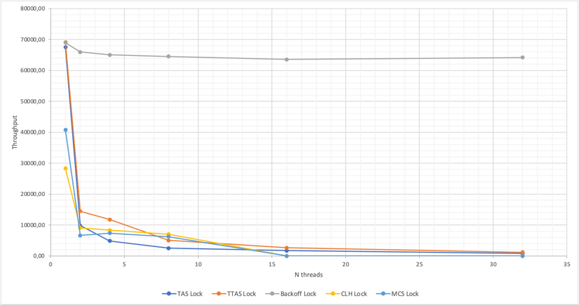

# Отчет по локам
В данном эксперименте исследовалась производительность локов (TAS, TTAS, Backoff, MCS, CLH),
в зависимости от количества потоков (от 1 до 32, логарифмическая шкала).

## Содержание
1. Описание эксперимента
   - Параметры бенчмарка
   - Необходимость и параметры прогрева
   - Методология оценки производительности
2. Результаты
3. Выводы

## 1.Описание эксперимента
### Параметры установки
Бенчмарк запускался со временем выполнения `60000 мс` с вариацией типа лока (TAS, TTAS, Backoff, MCS, CLH)
и числа потоков (1, 2, 4, 8, 16, 32).
```shell
benchmark --timeoutMs 60000 --type [TAS/TTAS/Backoff/MCS/CLH] --threadsCount [1/2/3/8/16/32]
```

### Необходимость прогрева и параметры
При старте нового JVM процесса (запуск приложения) все требуемые классы загружаются в память (jvm) сущностью `ClassLoader`'а.
Этот процесс происходит в 3 этапа:
- `BootstrapClassLoader` загружает Java код и требуемые Java classes из пакета java.lang.Object в память.
- `ExtensionClassLoader` отвечает за загрузку всех файлов JAR, расположенных по пути java.ext.dirs.
В приложениях, где не используется Maven или Gradle, разработчик добавляет JAR вручную, все эти классы загружаются на этом этапе.
- `ApplicationClassLoader` загружает все классы, расположенные по пути к классу приложения.

Весь этот процесс инициализации основан на схеме ленивой загрузки. То есть, загружаем класс только в случае отсутвия этого класса в памяти.

После завершения загрузки классов все классы, используемые во время запуска процесса, попадают в кэш
JVM, что ускоряет их доступ во время выполнения. Другие классы загружаются по запросу.
Например, при первом запуске нашего приложения счётчик значительно меньше, чем его среднее значение
по запускам. Этот период "разминки" можно отнести к ленивой загрузке класса и just-in-time компиляции.

При тестировании производительности нам нужно обеспечить минимальную latency, поэтому необходимо
заранее кэшировать все классы, чтобы они были доступны мгновенно при доступе во время выполнения.
Что говорит нам о необходимости прогрева. Результаты ниже подтверждают наши предположения:


Заметим, что результаты производительности выше (на ~5%) с прогревом, чем результаты без прогрева и с увеличением
времени эта разница уменьшается. Это можно объяснить тем, что оптимизация кода (JIT-компилятор) у нас происходит
с некоторого момента на определённом значении счётчика, которое одинаковое (колеблется в небольших
пределах) от запуска к запуску, и с увеличением времени эксперимента у нас идёт рост значения
счётчика, соответственно вклад значения счётчика, полученного непосредственно перед оптимизацией,
уменьшается.

Необходимость в прогреве есть, т.к. это позволит нам улучшить производительность на ~5%, а при тестировании
производительности нам важны и такие улучшения. Небольшое улучшение в производительности можно объяснить тем, что
в критической секции выполняется достаточно небольшая работа на каждой итерации, что приводит к не таким
заметным улучшениям после оптимизации.

Также отметим, что здесь приведены результаты MCS лока, т.к. на этом типе лока наблюдалась
наибольшая разница в производительности (с прогревом и без него). Все результаты можно посмотреть
в файлике [calculations/results.xlsx](calculations/Results.xlsx).

### Методология оценки производительности

Для каждого типа лока `(TAS/TTAS/Backoff/MCS/CLH)` и количества потоков `(1/2/3/8/16/32)` запускаем
наш бенчмарк с `timeout=60s` -- всего 30 типов тестов, в каждом из которых по 6 итераций запуска
(перед которыми следовало несколько итераций прогрева).

Далее берём результаты этих шести итераций и вычисляем `throughput` и `latency` по следующим формулам:

где `AVG(Counter)`- среднее арифметическое значение счётчика за 6 итераций, а `AVG(time)` - среднее
арифметическое время выполнения (в миллисекундах) одной итерации за 6 итераций.

Заметим, что вычисленное выше `latency` включает в себя время ожидания захвата лока и
выполнения критической секции (захват лока -> увеличение счётчика на единицу -> отпускание
лока). Также заметим, что `latency` одного потока -- это чистое время выполнения критической
секции без ожидания захвата лока. Таким образом, мы можем учесть эти поправки, найдя разность
между уже вычисленным `latency` (по формуле выше) и `latency` для одного потока и, получив
при этом чистое `latency`, включающее в себя только время ожидания захвата лока. 
Соответственно, дальше в таблицах за чистое `latency` обозначим `Latency`, а за "грязное" -
`Dirty latency`

Ниже приведены результаты вычислений:


Изобразим получившиеся результаты на графиках:




Отметим, что график с latency отображается в логарифмическом масштабе по оси ординат для
большей наглядности при работе с малыми величинами.

### Выводы

`Здесь описать полученные результаты из таблиц и графиков.`
